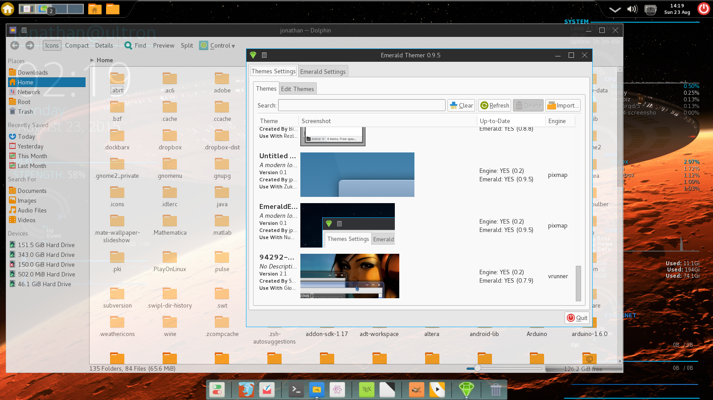

# Overview

EmeraldEdge is a modern flat theme for the Emerald themer running on the Compiz
window manager. It is modeled after my
[ModernUX](https://github.com/jpwchang/ModernUX) theme for Kwin, though it is
not a straight port and uses all-new resources. It is designed to go well with
most dark variants of the Numix GTK theme set, having been colored to blend
with the menubar color. However, it can also complement most other flat themes.

# Installation
Make sure you have Compiz installed using Emerald as its window decorator (see
the documentation for your specific Linux distro for directions). Then, simply
launch the Emerald theme manager and import the EmeraldEdge.emerald package.

# Preview

